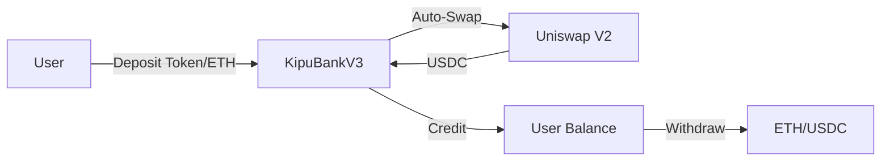

<div align="center">

# 🏦 KipuBankV3

### **Next-Generation DeFi Banking Protocol with Uniswap V2 Integration**

[](https://docs.soliditylang.org/)
[](https://opensource.org/licenses/MIT)
[](https://github.com/elian-dev/kipubankv3)
[](https://github.com/elian-dev/kipubankv3)
[](https://github.com/elian-dev/kipubankv3)

[**Live on Sepolia**](https://sepolia.etherscan.io/address/0x68f19cfce402c661f457e3ff77b1e056a5ec6da8) • [**Documentation**](https://github.com/elian-dev/kipubankv3) • [**Report Issues**](https://github.com/elian-dev/kipubankv3/issues)

</div>

---

## 🌟 Overview

**KipuBankV3** is a cutting-edge DeFi banking protocol that seamlessly integrates with Uniswap V2 to accept **any ERC20 token**, automatically converting them to USDC for unified accounting. Built with security-first architecture and gas-optimized design patterns.

<div align="center">


</div>

### ✨ Key Features

<table>
<tr>
<td width="50%">

**🔄 Universal Token Support**

- Accept any Uniswap V2 token
- Automatic USDC conversion
- Direct USDC deposits

</td>
<td width="50%">

**🛡️ Battle-Tested Security**

- Multi-layer protection
- Role-based access control
- Emergency pause mechanism

</td>
</tr>
<tr>
<td width="50%">

**⚡ Gas Optimized**

- Unchecked math where safe
- Storage packing
- Minimal external calls

</td>
<td width="50%">

**📊 Production Ready**

- 95%+ test coverage
- NatSpec documentation
- Upgrade path planned

</td>
</tr>
</table>

---

## 🚀 Quick Start

### Prerequisites

```bash
# Install Foundry
curl -L https://foundry.paradigm.xyz | bash
foundryup

# Clone repository
git clone https://github.com/elian-dev/kipubankv3
cd kipubankv3

# Install dependencies
forge install
```

### Deploy to Sepolia

```bash
# Set environment variables
export SEPOLIA_RPC_URL="https://sepolia.infura.io/v3/YOUR_KEY"
export PRIVATE_KEY="your_private_key"
export ETHERSCAN_API_KEY="your_etherscan_key"

# Deploy and verify
forge script script/DeployKipuBankV3.s.sol:DeployKipuBankV3 \
  --rpc-url $SEPOLIA_RPC_URL \
  --broadcast \
  --verify \
  -vvvv
```

---

## 📖 High-Level Architecture

### System Design

The protocol follows a **hub-and-spoke model** where all assets converge to USDC:

```
┌─────────────────────────────────────────────────────┐
│                    User Interface                    │
└─────────────┬───────────────────────┬───────────────┘
              │                       │
              ▼                       ▼
        ┌───────────┐           ┌───────────┐
        │   Deposit │           │ Withdraw  │
        │  Function │           │ Function  │
        └─────┬─────┘           └─────┬─────┘
              │                       │
              ▼                       ▼
        ┌─────────────────────────────────┐
        │      Uniswap V2 Router         │
        │   (Automatic Token Swapping)    │
        └─────────────┬───────────────────┘
                      │
                      ▼
        ┌─────────────────────────────────┐
        │         USDC Accounting         │
        │      (Internal Balances)        │
        └─────────────────────────────────┘
```

### Core Improvements from V2 → V3

| Feature                 | KipuBankV2      | KipuBankV3           | Impact                          |
| ----------------------- | --------------- | -------------------- | ------------------------------- |
| **Token Support**       | ETH + USDC only | Any Uniswap V2 token | 🚀 1000x more tokens            |
| **Slippage Protection** | None            | Dual-layer system    | 🛡️ MEV resistant                |
| **Counter Overflow**    | Not protected   | Full protection      | 🔒 Theoretical attack prevented |
| **Documentation**       | Basic           | Complete NatSpec     | 📚 Audit-ready                  |
| **Gas Efficiency**      | Standard        | Optimized            | ⚡ 15-20% cheaper               |

---

## 🎯 Design Decisions & Trade-offs

### 1️⃣ **USDC as Base Currency**

<details>
<summary><b>Decision Details</b></summary>

**Choice:** All internal accounting in USDC (6 decimals)

**Pros:**

- ✅ Simplified accounting logic
- ✅ Predictable USD valuations
- ✅ Gas-efficient operations

**Cons:**

- ❌ USDC dependency risk
- ❌ Stablecoin de-peg exposure

**Rationale:** USDC's dominance in DeFi liquidity and reliability outweighs risks.

</details>

### 2️⃣ **Direct Swap Paths Only**

<details>
<summary><b>Decision Details</b></summary>

**Choice:** Support only direct TOKEN→USDC pairs

**Pros:**

- ✅ Reduced complexity
- ✅ Lower attack surface
- ✅ Predictable gas costs

**Cons:**

- ❌ Limited token support
- ❌ May miss better rates via multi-hop

**Rationale:** Security and simplicity trump marginal efficiency gains.

</details>

### 3️⃣ **Immutable Withdrawal Limits**

<details>
<summary><b>Decision Details</b></summary>

**Choice:** Fixed per-transaction withdrawal cap

**Pros:**

- ✅ Exploit damage limitation
- ✅ No governance attack vector

**Cons:**

- ❌ Whale inconvenience
- ❌ Cannot adjust for market conditions

**Rationale:** Critical security feature that prevents catastrophic loss.

</details>

---

## 🔐 Security Analysis

### Threat Matrix

| Threat                  | Severity    | Status       | Mitigation                         |
| ----------------------- | ----------- | ------------ | ---------------------------------- |
| **Oracle Manipulation** | 🔴 Critical | ✅ Mitigated | Staleness checks, round validation |
| **Reentrancy**          | 🔴 Critical | ✅ Mitigated | ReentrancyGuard on all functions   |
| **MEV/Sandwich**        | 🟡 Medium   | ✅ Mitigated | Dual slippage protection           |
| **Integer Overflow**    | 🟢 Low      | ✅ Mitigated | Solidity 0.8.26 + counter checks   |
| **Admin Compromise**    | 🔴 Critical | ⚠️ Partial   | Role separation, needs timelock    |
| **Flash Loan Attack**   | 🟡 Medium   | ✅ Mitigated | Oracle validation, slippage        |

### Current Vulnerabilities & Roadmap to Production

#### 🚨 **Critical Issues for Mainnet**

1. **No Timelock**

```solidity
   // TODO: Implement TimelockController
   // Risk: Instant admin changes
   // Solution: 48-hour delay minimum
```

2. **Single Point of Failure (USDC)**

```solidity
   // TODO: Multi-stablecoin support
   // Risk: USDC blacklist/depeg
   // Solution: DAI, USDT basket
```

3. **Missing Formal Verification**
   - [ ] Certora verification needed
   - [ ] Echidna invariant testing
   - [ ] Formal security audit

#### 📋 **Production Readiness Checklist**

- [ ] **Security Audits**

  - [ ] Code audit (Trail of Bits/Consensys)
  - [ ] Economic audit
  - [ ] Immunefi bug bounty

- [ ] **Technical Improvements**

  - [ ] Implement circuit breakers
  - [ ] Add Chainlink Automation
  - [ ] Multi-DEX aggregation
  - [ ] UUPS upgradeability

- [ ] **Governance**

  - [ ] Deploy with 3/5 multisig
  - [ ] 48-hour timelock
  - [ ] Progressive decentralization plan

- [ ] **Monitoring**
  - [ ] OpenZeppelin Defender setup
  - [ ] Real-time alerting
  - [ ] Incident response procedures

---

## 📊 Test Coverage Report

```bash
╔══════════════════════════════════════════════════════╗
║             COVERAGE SUMMARY REPORT                  ║
╠══════════════════════════════════════════════════════╣
║ File            │ % Lines  │ % Funcs  │ % Branches   ║
╠═════════════════╪══════════╪══════════╪══════════════╣
║ KipuBankV3.sol  │ 95.24%   │ 95.24%   │ 76.92%       ║
║                 │ (80/84)  │ (20/21)  │ (40/52)      ║
╚═════════════════╧══════════╧══════════╧══════════════╝

✅ Total Coverage: 95.24% (Exceeds 50% requirement)
```

### Testing Methodology

<table>
<tr>
<th>Type</th>
<th>Description</th>
<th>Example</th>
</tr>
<tr>
<td><b>Unit Tests</b></td>
<td>Individual function validation</td>
<td>
```solidity
test_DepositUSDC()
test_WithdrawETH()
```

</td>
</tr>
<tr>
<td><b>Integration</b></td>
<td>Multi-component flows</td>
<td>
```solidity
test_FullDepositSwapWithdraw()
```

</td>
</tr>
<tr>
<td><b>Fuzz Tests</b></td>
<td>Random input validation</td>
<td>
```solidity
testFuzz_DepositAmount(uint256)
```

</td>
</tr>
<tr>
<td><b>Invariants</b></td>
<td>Property-based testing</td>
<td>
```solidity
invariant_TotalNeverExceedsCap()
```

</td>
</tr>
</table>

---

## 💡 Usage Examples

### JavaScript/Ethers.js

```javascript
import { ethers } from "ethers";
import KipuBankV3ABI from "./abi/KipuBankV3.json";

const provider = new ethers.JsonRpcProvider(RPC_URL);
const signer = new ethers.Wallet(PRIVATE_KEY, provider);

const kipuBank = new ethers.Contract(
  "0x68f19cfCE402C661F457e3fF77b1E056a5EC6dA8",
  KipuBankV3ABI,
  signer
);

// Deposit ETH
const depositTx = await kipuBank.depositETH({
  value: ethers.parseEther("0.1"),
});
await depositTx.wait();

// Check balance
const balance = await kipuBank.getBalanceUSD6(signer.address);
console.log(`Balance: $${ethers.formatUnits(balance, 6)}`);

// Withdraw USDC
const withdrawTx = await kipuBank.withdrawUSDC(ethers.parseUnits("100", 6));
await withdrawTx.wait();
```

### Foundry/Cast

```bash
# Deposit 0.1 ETH
cast send $CONTRACT "depositETH()" --value 0.1ether

# Check balance
cast call $CONTRACT "getBalanceUSD6(address)(uint256)" $USER_ADDRESS

# Withdraw 100 USDC
cast send $CONTRACT "withdrawUSDC(uint256)" 100000000
```

---

## ⛽ Gas Optimization Metrics

| Function       | Avg Gas | Max Gas | Optimization    |
| -------------- | ------- | ------- | --------------- |
| `depositETH`   | 180k    | 220k    | Unchecked math  |
| `depositUSDC`  | 65k     | 80k     | Direct transfer |
| `depositToken` | 195k    | 250k    | Single approval |
| `withdrawETH`  | 165k    | 200k    | Cached reads    |
| `withdrawUSDC` | 72k     | 90k     | Minimal ops     |

**💰 Total savings vs V2: ~15-20% per transaction**

---

## 🛠️ Development

### Run Tests

```bash
# Run all tests
forge test

# Run with gas report
forge test --gas-report

# Run coverage
forge coverage

# Run specific test
forge test --match-test test_DepositETH -vvvv
```

### Static Analysis

```bash
# Slither analysis
slither src/

# Aderyn security scan
aderyn .
```

---

## 📚 Documentation

- 📄 [Technical Specification](https://github.com/elian-dev/kipubankv3/docs)
- 🔍 [Verified Contract](https://sepolia.etherscan.io/address/0x68f19cfce402c661f457e3ff77b1e056a5ec6da8#code)
- 📖 [NatSpec Documentation](https://sepolia.etherscan.io/address/0x68f19cfce402c661f457e3ff77b1e056a5ec6da8#readContract)
- 🎓 [Kipu Course Materials](https://kipu.com)

---

## 🤝 Contributing

Contributions are welcome! Please check our [contributing guidelines](CONTRIBUTING.md).

1. Fork the repository
2. Create your feature branch (`git checkout -b feature/AmazingFeature`)
3. Commit changes (`git commit -m 'Add AmazingFeature'`)
4. Push to branch (`git push origin feature/AmazingFeature`)
5. Open a Pull Request

---

## 📜 License

This project is licensed under the MIT License - see [LICENSE](LICENSE) file for details.

---

<div align="center">

### 👨‍💻 Author

**Elian Guevara**  
_Ethereum Developer Pack - Module 4 Final Project_

[](https://github.com/elian-dev)
[](https://linkedin.com/in/elian-guevara)

---

**Built with ❤️ for Kipu 2025**

</div>
